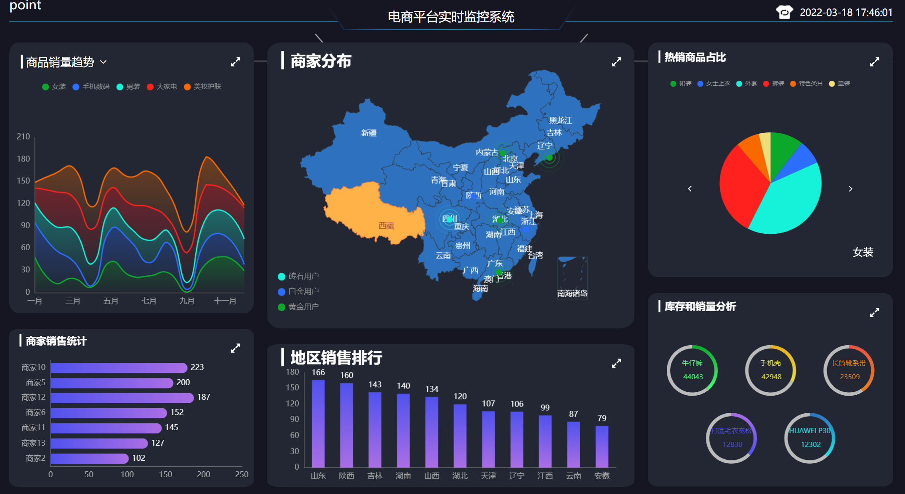
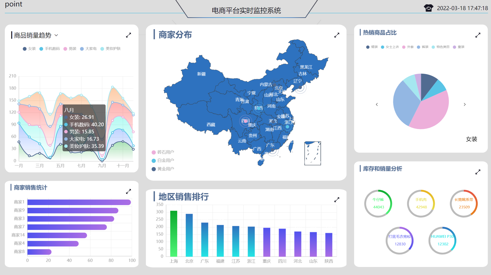
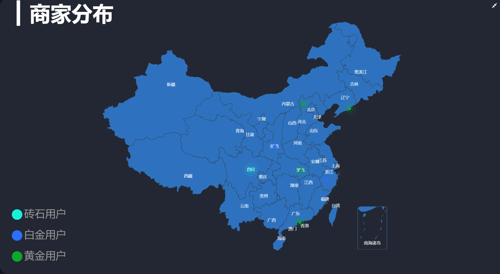

# 专项 echarts 数据展示项目

## 安装依赖

```js
npm install // 安装前端依赖
cd server
npm install // 安装后端依赖
```

### 项目运行

```js
npm run serve// 运行前端项目
npm run dev // 运行后端项目
```

### 项目展示







### 使用技术

```js
echarts // 开源可视化图表库
axios
webSocket // 互联网交互架构应用层的协议
koa2 // 基于 nodejs 平台的 web 开发框架
```


### 实现功能

#### 视图模块

- 支持大屏展示

#### 屏幕适配模块

- 通过监听屏幕改变的事件，从新计算字体的大小，实现字体大小的适配
- 通过 echartsInstance.resize（）实现改变图表尺寸
- 通过 debounce 函数实现屏幕响应函数的频繁调用

#### 换肤模块

- 当主题发生改变时重新初始化视图

#### 视图联动模块

- 一端操作，多端联动
- 通过 webSocket 实现数据推送

### 关于我

###### QQ:965536741 微信：xlh950829
